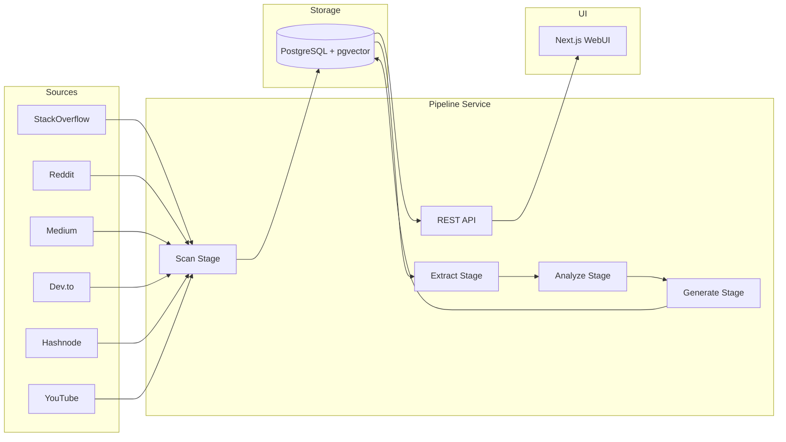

# TopicScanner

AI-powered DevRel intelligence platform. Automatically discovers trending topics from developer communities, extracts and analyzes content with LLMs, and generates publication-ready material.

## Architecture



**Key design decisions:**
- **PostgreSQL job queue** (`SELECT ... FOR UPDATE SKIP LOCKED`) replaces Kafka — simpler ops, same guarantees
- **4-stage pipeline**: Scan → Extract → Analyze → Generate, each stage driven by a Quartz scheduler polling the DB
- **Pluggable scanners**: `SourceScanner` interface — built-in scanners via Spring `@Component`, external plugins via `ScannerRegistry` + ServiceLoader from `plugins/` directory
- **LLM abstraction**: `LLMService` interface with task-specific models — supports Ollama, OpenAI, Anthropic (Claude)
- **pgvector embeddings**: 1536-dim vectors for semantic dedup and RAG-enhanced content generation
- **7-stage filter pipeline** (cheapest first): URL dedup → negative keywords → language → content length → quality → relevance → embedding dedup

## Quick Start

### Local Development (Docker Compose)

```bash
# Start PostgreSQL + Ollama
docker compose up -d

# Build and run pipeline-service (from project root)
mvn spring-boot:run -pl pipeline-service -Dspring-boot.run.profiles=local

# Build and run webui
cd webui-nodejs
npm install && npm run dev
```

### Kubernetes (Helm)

```bash
# Add Bitnami repo for PostgreSQL subchart
helm dependency build helm/cloud-native-scanner-v2/

# Install with Ollama (default)
helm install scanner helm/cloud-native-scanner-v2/ \
  --set postgresql.auth.password=changeme \
  --set llm.ollama.url=http://ollama:11434

# Install with OpenAI
helm install scanner helm/cloud-native-scanner-v2/ \
  --set postgresql.auth.password=changeme \
  --set llm.provider=openai \
  --set llm.model=gpt-4o-mini \
  --set llm.apiKey=sk-...

# Enable ingress
helm install scanner helm/cloud-native-scanner-v2/ \
  --set ingress.enabled=true \
  --set ingress.hosts[0].host=scanner.example.com
```

## Configuration Reference

| Value | Description | Default |
|-------|-------------|---------|
| `llm.provider` | LLM provider: `ollama`, `openai`, `anthropic`, `azure-openai`, `gemini` | `ollama` |
| `llm.model` | Model name | `llama3` |
| `llm.apiKey` | API key (not needed for Ollama) | `""` |
| `llm.ollama.url` | Ollama server URL | `http://ollama:11434` |
| `llm.fallback.enabled` | Enable fallback LLM provider | `false` |
| `llm.fallback.provider` | Fallback provider | `openai` |
| `llm.fallback.model` | Fallback model | `gpt-4o-mini` |
| `pgvector.enabled` | Enable pgvector for embeddings | `true` |
| `pgvector.dimensions` | Embedding vector dimensions | `1536` |
| `scanners.reddit.enabled` | Enable Reddit scanner | `false` |
| `scanners.reddit.clientId` | Reddit OAuth client ID | `""` |
| `scanners.reddit.clientSecret` | Reddit OAuth client secret | `""` |
| `scanners.stackoverflow.enabled` | Enable StackOverflow scanner | `true` |
| `scanners.medium.enabled` | Enable Medium scanner | `true` |
| `scanners.devto.enabled` | Enable Dev.to scanner | `true` |
| `scanners.hashnode.enabled` | Enable Hashnode scanner | `true` |
| `scanners.youtube.enabled` | Enable YouTube scanner | `false` |
| `scanners.youtube.apiKey` | YouTube Data API key | `""` |

## Project Structure

```
.
├── shared/                  # JPA entities, repositories, shared services
├── pipeline-service/        # Spring Boot app — scan, extract, analyze, generate
│   ├── src/main/java/com/topicscanner/
│   │   ├── api/             # REST controllers (Dashboard, Topics, Categories, Pipeline, Studio)
│   │   ├── scanner/         # SourceScanner SPI + built-in implementations
│   │   ├── extraction/      # Content extraction stage
│   │   ├── analyzer/        # Classification and analysis stage
│   │   ├── generator/       # Content generation stage
│   │   ├── queue/           # PostgreSQL job queue
│   │   ├── llm/             # LLMService interface + provider implementations
│   │   └── filter/          # 7-stage filter chain
│   └── Dockerfile
├── webui-nodejs/            # Next.js 14 App Router frontend
│   ├── app/                 # Pages: dashboard, topics, categories, studio, pipeline
│   ├── components/          # shadcn/ui-style components
│   ├── lib/                 # API client, utilities
│   └── Dockerfile
├── helm/cloud-native-scanner-v2/  # Helm chart
├── .github/workflows/ci.yaml     # GitHub Actions CI
└── pom.xml                        # Maven parent POM
```

## Development Setup

**Prerequisites:** Java 17, Maven 3.9+, Node.js 18+, PostgreSQL 15+ (or Docker)

```bash
# Clone
git clone https://github.com/cloud-native-scanner/CloudNativeScanner.git
cd CloudNativeScanner

# Build Java modules
mvn clean install -DskipTests

# Build pipeline-service only
mvn package -pl shared,pipeline-service -am -DskipTests

# Run tests
mvn verify -pl shared,pipeline-service -am

# Frontend
cd webui-nodejs
npm install
npm run dev        # http://localhost:3000
npm run lint
npx tsc --noEmit   # type check
```

## Tech Stack

| Layer | Technology |
|-------|-----------|
| Backend | Spring Boot 3.2, Java 17, JdbcTemplate, Quartz |
| Frontend | Next.js 14, React, Tailwind CSS, TypeScript |
| Database | PostgreSQL 15 + pgvector |
| LLM | Ollama / OpenAI / Anthropic / Azure / Gemini |
| Build | Maven (Java), npm (frontend) |
| CI/CD | GitHub Actions → GHCR |
| Deploy | Helm 3 on Kubernetes |

## License

MIT
