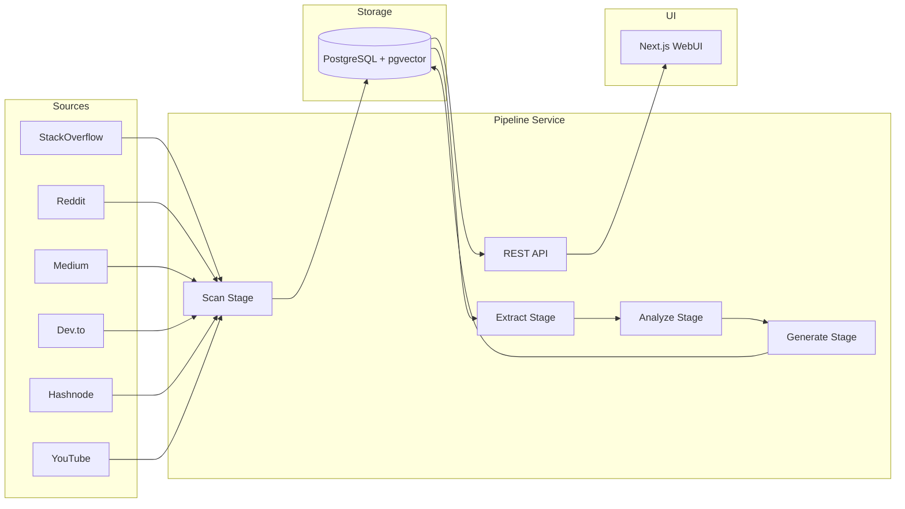
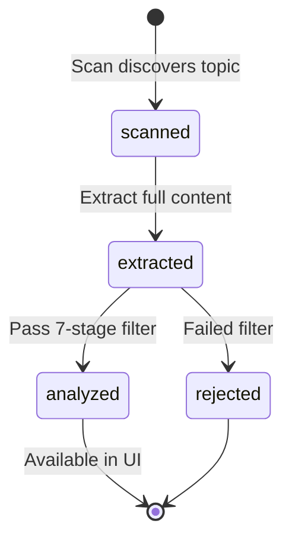
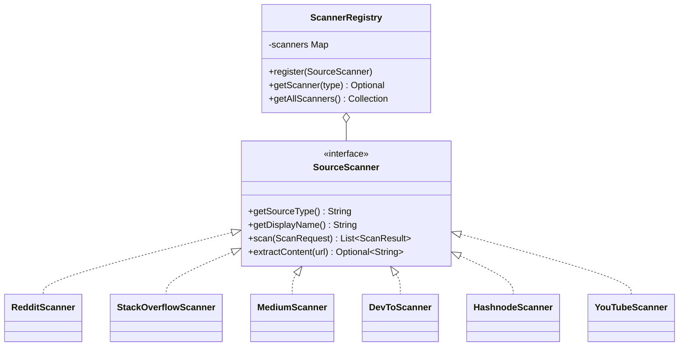
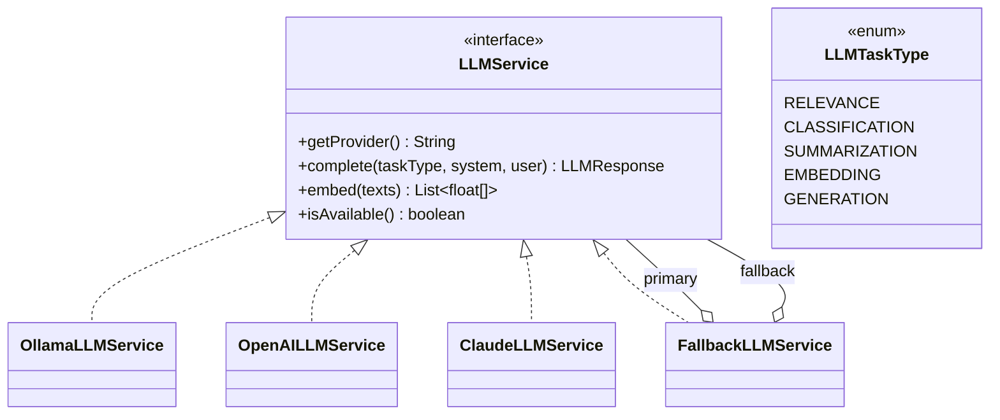
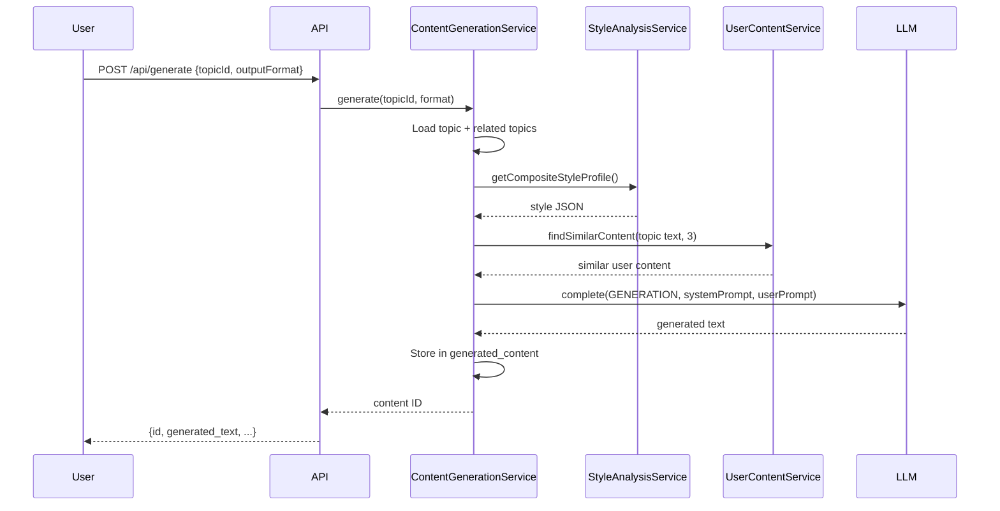

# Architecture

## System Overview



## Pipeline Stages

Topics flow through four stages, each managed by the PostgreSQL job queue:



### Stage 1: Scan

The `ScanOrchestrator` runs on a cron schedule (default: 6 AM daily, configurable via `topicscanner.pipeline.scan-cron`). For each enabled category:

1. Get category keywords and configured source types
2. For each source, get the `SourceScanner` from `ScannerRegistry`
3. Call `scanner.scan(ScanRequest)` — returns list of `ScanResult`
4. Persist new topics via `INSERT ... ON CONFLICT DO NOTHING` (URL + source dedup)
5. Enqueue `EXTRACT` job for each new topic

### Stage 2: Extract

The `ExtractStageHandler` fetches full content from each discovered URL:

1. Try the scanner's custom `extractContent(url)` method first
2. Fall back to source-specific extractors (YouTube transcripts, SO Q&A)
3. Fall back to generic web extraction (Jsoup readability-style)
4. Store extracted content, enqueue `ANALYZE` job

### Stage 3: Analyze

The `AnalyzeStageHandler` runs the 7-stage filter pipeline:

1. **URL dedup** (order 10) — reject if URL already analyzed
2. **Negative keywords** (order 20) — reject if matches exclusion terms
3. **Language** (order 30) — reject non-English content (ASCII ratio + stop words)
4. **Content length** (order 40) — reject if < 200 chars
5. **Quality** (order 45) — score based on structure (headings, code blocks, paragraphs)
6. **Relevance** (order 50) — LLM scores relevance to category keywords (0.0–1.0)
7. **Embedding dedup** (order 70) — pgvector cosine similarity rejects near-duplicates

Filters are ordered cheapest-first. The pipeline short-circuits on the first failure.

### Stage 4: Generate

Content generation is triggered on-demand via the Content Studio UI or API. The `ContentGenerationService`:

1. Loads the topic and up to 5 related topics from the same group
2. Retrieves the user's composite writing style profile
3. Finds similar user-uploaded content via pgvector (RAG context)
4. Builds format-specific prompts with style + RAG context
5. Calls LLM with `GENERATION` task type
6. Stores result in `generated_content` table

## Scanner System



Built-in scanners are Spring `@Component` beans auto-discovered via classpath scanning. External plugins are JARs in the `plugins/` directory loaded via `ServiceLoader`.

## LLM Abstraction



Each provider supports **task-specific models** — you can use a small model for relevance scoring and a large model for content generation. The `FallbackLLMService` wraps primary + fallback, trying primary first and falling back on failure.

## Job Queue

The pipeline uses PostgreSQL as a job queue instead of Kafka:

```sql
-- Claim next job (atomic, skip locked)
UPDATE pipeline_jobs
SET status = 'PROCESSING', started_at = NOW(), updated_at = NOW()
WHERE id = (
    SELECT id FROM pipeline_jobs
    WHERE stage = ? AND status = 'PENDING'
    ORDER BY created_at ASC
    LIMIT 1
    FOR UPDATE SKIP LOCKED
)
RETURNING *;
```

The `PipelineOrchestrator` polls each stage on a configurable interval (default: 30 seconds). Stale jobs (stuck in `PROCESSING` for > 10 minutes) are automatically reset to `PENDING`.

## Content Generation Flow


