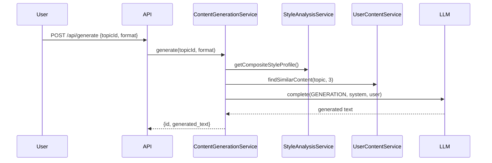

# Content Studio

The Content Studio lets you upload your existing writing, analyze your style, and generate new content that matches your voice.

## Writing Style Analysis

Upload content (paste text or import from URL) to build your style profile.

### How It Works

1. **Upload** content via `POST /api/content` or `POST /api/content/import`
2. **Analyze** style via `POST /api/content/{id}/analyze`
3. The LLM produces a JSON style profile:

```json
{
  "tone": "conversational",
  "avg_sentence_length": "medium",
  "vocabulary_complexity": "moderate",
  "structural_patterns": ["uses headers", "code examples", "bullet points"],
  "use_of_examples": true,
  "use_of_analogies": true,
  "first_person": true,
  "typical_intro_style": "Opens with a relatable problem statement",
  "typical_conclusion_style": "Summarizes key takeaways with action items"
}
```

### Composite Style Profile

When you have multiple uploads, `GET /api/content/style-profile` merges them into a single composite profile using the LLM. The composite profile is used during content generation.

## Content Generation

### Output Formats

| Format | Description |
|--------|------------|
| `blog_post` | Comprehensive post with intro, headings, code examples, conclusion |
| `youtube_script` | Video script with hook, sections, `[VISUAL]` cues, CTA. 8-12 min target |
| `linkedin_post` | Under 3000 chars. Hook, short paragraphs, question/CTA, hashtags |
| `newsletter` | Conversational, scannable with headers and bullets, key takeaways |

### Generation Pipeline

1. Load the target topic and up to 5 related topics from the same group
2. Fetch composite style profile (from your uploaded content)
3. **RAG retrieval** — find up to 3 similar pieces of your uploaded content via pgvector cosine similarity
4. Build system prompt: format instructions + style profile + RAG examples
5. Call LLM with `GENERATION` task type
6. Store result in `generated_content` table



### Regeneration with Feedback

If the output isn't right, regenerate with feedback:

```
POST /api/generate/{id}/regenerate
{ "feedback": "Make it more technical, add code examples" }
```

The system uses the original content + your feedback to produce a revised version. Maximum 5 regenerations per topic+format.

### Export

Export generated content as Markdown:

```
GET /api/generate/{id}/export?format=markdown
```

## RAG Workflow

The RAG (Retrieval-Augmented Generation) workflow enhances content generation by referencing your previous writing:

1. **Embedding** — When you upload content, it's embedded as a 1536-dim vector via the LLM embedding model
2. **Retrieval** — During generation, the topic text is embedded and compared to your content library via pgvector cosine similarity
3. **Context** — The top 3 most similar pieces of your content are included in the LLM prompt as style/voice references

!!! note
    RAG requires pgvector to be enabled. Without it, generation still works but without style-matched references.

## Content Types

When uploading, specify a content type (informational, used for organization):

| Type | Description |
|------|------------|
| `blog_post` | Blog articles |
| `transcript` | Video/podcast transcripts |
| `newsletter` | Newsletter issues |
