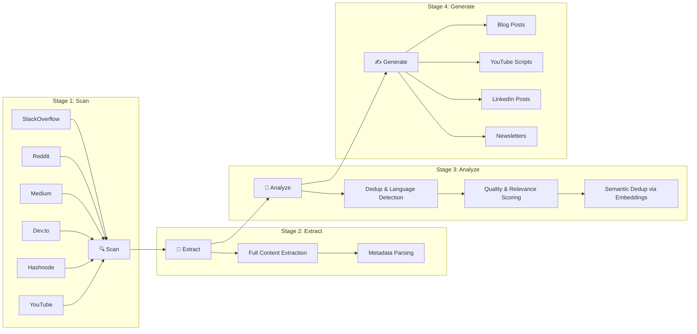
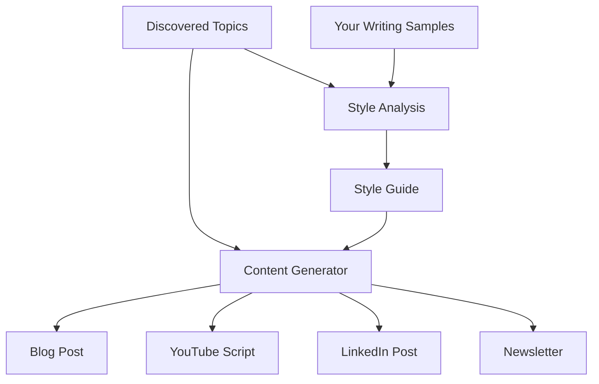

# TopicScanner

AI-powered DevRel intelligence platform. Automatically discovers trending topics from developer communities, extracts and analyzes content with LLMs, and generates publication-ready material.

## What It Does



1. **Scans** developer communities (StackOverflow, Reddit, Medium, Dev.to, Hashnode, YouTube) for trending topics
2. **Extracts** full content from discovered URLs
3. **Analyzes** content through a 7-stage filter pipeline — dedup, language detection, quality scoring, relevance scoring, and semantic dedup via embeddings
4. **Generates** publication-ready content (blog posts, YouTube scripts, LinkedIn posts, newsletters) using your writing style

## Content Generation Flow



!!! tip "Content Studio"
    Upload your existing writing to the [Content Studio](content-studio.md) and TopicScanner will analyze your style, then generate new content that matches your voice.

## Key Features

- **Pluggable scanner system** — built-in scanners via Spring `@Component`, external plugins via ServiceLoader. See [Scanners](scanners.md).
- **LLM abstraction** — task-specific models across Ollama, OpenAI, and Anthropic (Claude). See [LLM Models](llm-models.md).
- **Content Studio** — upload your writing, analyze your style, generate new content that matches your voice. See [Content Studio](content-studio.md).
- **PostgreSQL job queue** — no Kafka dependency, uses `SELECT ... FOR UPDATE SKIP LOCKED`
- **pgvector embeddings** — semantic dedup and RAG-enhanced content generation
- **Gateway API routing** — native Kubernetes Gateway API support with HTTPRoutes

## Tech Stack

| Layer | Technology |
|-------|-----------|
| Backend | Spring Boot 3.4.3, Java 17, JdbcTemplate, Quartz |
| Frontend | Next.js 14, React, Tailwind CSS, TypeScript |
| Database | PostgreSQL 15+ with pgvector |
| LLM | Ollama / OpenAI / Anthropic (Claude) |
| Build | Maven (Java), npm (frontend) |
| CI/CD | GitHub Actions, GHCR |
| Deploy | Helm 3 on Kubernetes with Gateway API |

## Prerequisites

Before deploying TopicScanner, ensure you have:

- **Kubernetes 1.28+** with Gateway API CRDs installed
- **Helm 3.x**
- **Ollama** with required models (see [LLM Models](llm-models.md)):

```bash
ollama pull qwen2.5:14b       # relevance + classification
ollama pull qwen2.5:32b       # summarization + generation
ollama pull nomic-embed-text   # embeddings
```

- **Gateway API CRDs**:

```bash
kubectl apply -f https://github.com/kubernetes-sigs/gateway-api/releases/download/v1.2.0/standard-install.yaml
```

- **A GatewayClass provider** — one of: Istio, Cilium, Traefik, or Envoy Gateway
- **PostgreSQL 15+** — deployed by the Helm chart or provided externally

!!! warning
    Gateway API CRDs must be installed **before** deploying the Helm chart if `gateway.enabled=true`.

!!! note
    For detailed prerequisites and step-by-step setup, see the [Getting Started](getting-started.md) guide.

## Quick Start

### Docker Compose (local dev)

```bash
# Start PostgreSQL
docker compose up -d

# Run pipeline-service
mvn spring-boot:run -pl pipeline-service -Dspring-boot.run.profiles=local

# Run webui
cd webui-nodejs && npm install && npm run dev
```

### Kubernetes (Helm)

```bash
# Install Gateway API CRDs
kubectl apply -f https://github.com/kubernetes-sigs/gateway-api/releases/download/v1.2.0/standard-install.yaml

# Build chart dependencies
helm dependency build helm/cloud-native-scanner-v2/

# Install with Gateway API routing
helm install scanner helm/cloud-native-scanner-v2/ \
  --set postgresql.auth.password=changeme \
  --set llm.ollama.url=http://ollama:11434 \
  --set gateway.enabled=true \
  --set gateway.className=istio \
  --set gateway.hostname=scanner.example.com
```

See [Deployment](deployment.md) for full Helm configuration and [Getting Started](getting-started.md) for a complete walkthrough.

## Screenshots

*Screenshots coming soon*

## Learn More

- [Getting Started](getting-started.md) — full step-by-step setup guide
- [Architecture](architecture.md) — system design and pipeline details
- [Configuration](configuration.md) — environment variables and tuning
- [API Reference](api-reference.md) — REST API documentation
- [Development](development.md) — contributing and local dev setup
